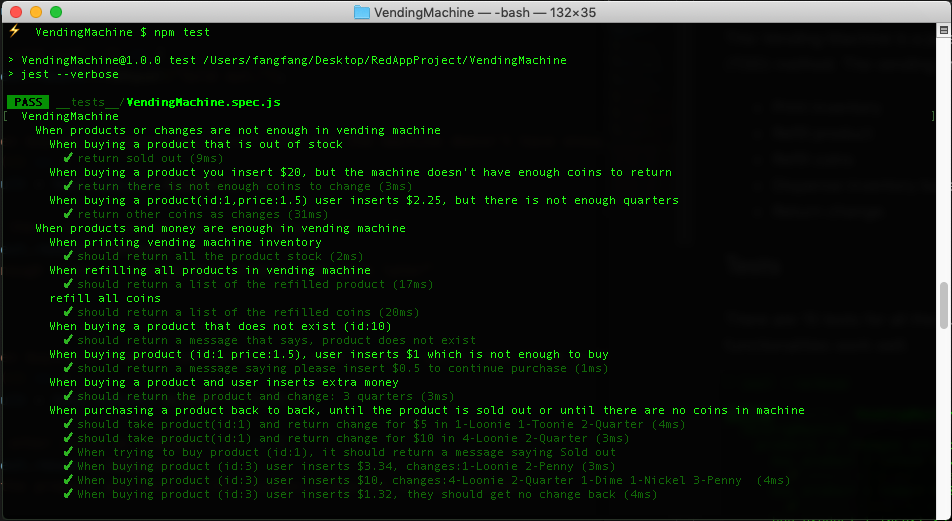

# Vending Machine (Testing Practice)

This Vending Machine is a javascript class, which is implemented with Test-driven Development (TDD) method. The vending machine has the following functions:

- Print inventory
- Refill product
- Refill coins
- Dispense inventory based on the payment
- Return change.

In this project, I wrote the tests and considered the purposes first. The testing method can give me fast feedback and the coding processes are very efficient. I spent less time on 'console.log', and I can target the errors easily. This is a perfect practice for Test-driven development.

## Tests

There are 15 tests for all the functionalities, and all the tests got a pass. The tests proof the functionalities work well.



### Tests Details

- Invalid Product Selection
- Enough Money Input
- Too Much Money Input, Cannot Change
- Product Sold Out
- No coins to change
- Get Change When Coins Are Enough
- Get Change When Some Coins Are Insufficient
- Purchasing a Product Back to Back Until Sold Out
- Successful Purchasing
- Perfect Money Input

## Instructions for Running

### Installation of required modules

```bash
npm install
```

### Run the test

```bash
npm test
```
